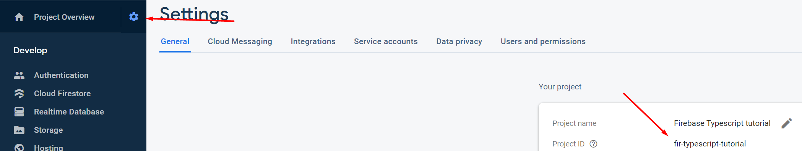

# Welcome to my Firebase + TypeScript tutorial!

## Introduction

This repo is a brief tutorial repo on how to use Firebase using TypeScript. In here, you will have the chance to:

1. Learn how TypeScript works
2. Learn how Firebase Functions (Cloud Functions) and Firestore work

I hope you guys enjoy :D Lemme know if you have any question

## Get started

### Prerequisite

For npm projects in general, you will need to install

1. NodeJS: https://nodejs.org/en/download/
2. npm: https://www.npmjs.com/get-npm (should be already installed with NodeJS)
3. TypeScript package: https://code.visualstudio.com/docs/typescript/typescript-compiling
4. Firebase CLI: https://firebase.google.com/docs/cli

### Repo structure:

1. `/docs` folder will store all the documentation I have for you guys
2. `/functions` folder will store all the tutorial files related to Cloud Functions
3. `/typescript` folder will store all the tutorial files related to TypeScript

### **Note**

1. ! Make sure you're in the correct folder before start working on any project. For example,
   1. if you want to start TypeScript compilation, go to `/typescript/` folder first!
   2. if you want to start install package for Cloud Functions project, go to `/functions/` folder then run `npm install <package name>` after
2. I suggest you create your own Firebase project now or else you won't be able to run anything in `/functions/`
   1. To set up a Firebase project, go to [link](https://firebase.google.com/) and follow the steps written.
   2. Once you finishes, go to your Firebase console, click the cog icon on the sidebar, choose `Project settings` and copy your project ID. 
   3. Change the current project's id `fir-typescript-tutorial` to your project id in `/.firebaserc`.

### Some useful commands

1. `npm install`: Node JS will check for `package.json` file and install the dependencies based on what is written in that file. [Doc](https://docs.npmjs.com/cli/install)
2. `npm install <package name>`: Node JS will install `<package name>` into the current working  directory or project => MAKE SURE to go into the correct folder first before running this command! [Doc](https://docs.npmjs.com/cli/install)
3. `firebase init`: initialize Firebase project using Firebase CLI into this directory. You don't have to run it again, I already ran it. [Doc](https://firebase.google.com/docs/cli)
4. `firebase emulators:start`: Firebase CLI will start the local emulator for the project you initiated with. [Doc](https://firebase.google.com/docs/rules/emulator-setup)

## Ready?

1. First, let's go to `/typescript/` for tutorial about TypeScript. We will code Cloud Function using TypeScript, so that's quite useful to learn it first. You can take a look at `typescript.md` for my brief documentation about it.
2. Then you can explore `/functions/` for tutorial about Cloud Functions! Please take a look at `firebase.md` to know how to start the project in detail.
